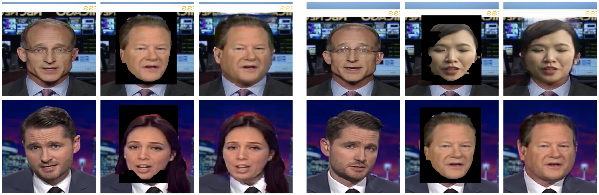
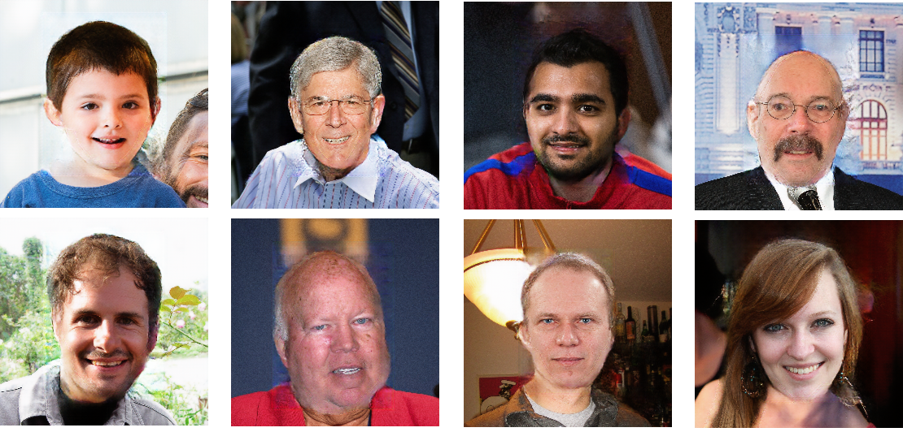
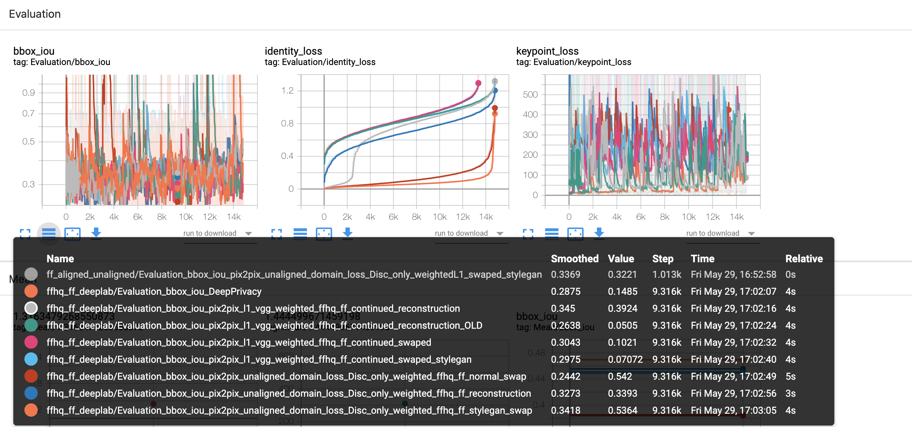

# Facial-Data-Anonymization-with-Deep-Neural-Networks

## Intro 

With the rise of privacy protection for data and legal consequences for violation proper anonymization methods are needed for all kinds of data. With images depicting people who are clearly identifiable, companies in Europe would be require to attain consent under the GDPR \cite{GDPR}. Deep Learning is especially affected, as visual data recorded by e.g. cars for autonomous driving might fall into this category. With constant change in legislation companies want to be on the safe side. 
Therefore this work focuses on the strongest anonymization method, i.e. full facial anonymization. Our pipeline consists of (1) facial detection, (2) foreground/background segmentation of the head, face and hair, (3) blacking out this detected region, (4) pasting a fitting replacement head extracted from a collection of (generated) face images and finally (4) blending the image to fill in missing information. Using pre-generated faces or real faces makes our approach similar to a "Head Swap". 

## Examples
Original, preprocessed and result. 



And then just results:


# Installation
1. Download  [dlib shape_predictor_68_face_landmarks](https://github.com/AKSHAYUBHAT/TensorFace/blob/master/openface/models/dlib/shape_predictor_68_face_landmarks.dat) and put it in head_swap/preprocess/pretrained_models/shape_predictor_68_face_landmarks.dat 
```
wget https://github.com/AKSHAYUBHAT/TensorFace/raw/master/openface/models/dlib/shape_predictor_68_face_landmarks.dat
```

Then please install all packages. I recommend to use poetry for that. see https://python-poetry.org/

```
cd segmentation
poetry install
cd ../head_swap
poetry install
```

# Create Training set

## Segmentation Model
### Get base data
1. Get mask data from https://github.com/switchablenorms/CelebAMask-HQ
1. Preprocess to create data for seg model
  - cd head_swap
  - poetry run python preprocess/process_celebA_masks_pix2pix.py --data_path /data/path --processed_path /save/path
  - you have the option to exclude masks with e.g. --no_misc or --no_hair
  
### Run Segmentation Model 
1. cd segmentation
1. change the root to your data folder in 'segmentation/core/data/dataloader/celebahq.py'
1. Run the segmentation model over your data of faces

```
poetry run python scripts/train.py
```

## Run Data Processing

1. Download data you want to use (e.g. FFHQ dataset)
1. enter the head_swap folder 'cd head_swap'
1. Run the script to create the training set:

```
CUDA_VISIBLE_DEVICES=0 poetry run python preprocess/create_blending_dataset.py --data_path /path/to/data --save_path /path/to/folder --with_segmentation --segmentation_path  /path/to/segmentations --use_fake_face --fake_face_folder  /path/to/faces/to/use --mask_segmentation_path  /path/to/segmentation/of/fake/faces
```

# Models

.Models
│
├── pix2pix_vgg
│   VGG and normal L1 loss
├── pix2pix_weightedL1
│   Weigthed L1 loss, set weight of L1 loss with --mask_scale
├── pix2pix_weightedL1_edges
│   as above but weights edges even stronger, set --edge_mask_scale
├── pix2pix_vgg_weightedL1
│   VGG and L1 loss; set --vgg_weights and --vgg_scaling, set weight of L1 loss with --mask_scale
│
├── pix2pix_unaligned_domain_loss
│   Vgg, l1 and unaligned domain
├── pix2pix_unaligned_domain_loss_kornia
│   same as above, different implementation
│
├── pix2pix_keypoints
│   keyypoint model to work in 68 one hot encoded keypoints + 3 image dimensions -> 71x256x256
│
├── pix2pix_facenet
│   Cosine similarity loss on facenet embeddings + L1 loss
├── pix2pix_vgg_facenet
│   VGG, L1 and cosine similarity loss on facenet embeddings

# Train
You can train the model with follwoing command:

```
poetry run python ./network/train.py  --dataroot DATAROOT --name NAME --model MODEL --direction BtoA --gpu_ids GPU_ID
```

The dataroot should contain a train folder with the images concatenated in 256x512. The real one on the left, input to model on the right. You can watch the training process via tensorboard (logging in .

# Test

```
poetry run python ./network/test.py  --dataroot DATAROOT --name NAME --model MODEL --direction BtoA --gpu_ids GPU_ID
```
This creates a folder /network/results/MODEL/... with the results. 

# Evaluate

Example data structre required for the evaluation. 

```
.{data_path}
├── method1
│   ├── result.png
│   ├── result2.png
├── method2
│   ├── result.png
│   ├── result2.png
├── real
│   ├── result.png
│   ├── result2.png
```

Run the following command with (--ground_truth_folder takes the name of the folder containing the real data)

```
CUDA_VISIBLE_DEVICES=0 poetry run python head_swap/postprocess/get_metrics.py --file_type=.png --data_path=/path/to/evaluation/folder/ --ground_truth_folder=real
```

This creates a tensorboard log that you can start in ./logs. with 

```
tensorboard --logdir=/path/to/logs --port=PORTNUMBER
```



# Full Pipeline for test case

Run the ./pipeline/head_swap_pipeline.sh file with all required arguments or edit the file to include them.

This script does all pipeline steps and outputs the anonymized image. Dont forget to make it executable first.


```
./pipeline/head_swap_pipeline.sh {data_source_path} {preprocess_save_path} {gpu_id} {model_name} {result_dir} {fake_face_folder} {mask_segmentation_path}
```

# Code and repos used in this project

- Age and Gender model: https://github.com/yu4u/age-gender-estimation/
- Pix2pix: https://github.com/phillipi/pix2pix
- FaceNet: https://github.com/timesler/facenet-pytorch

